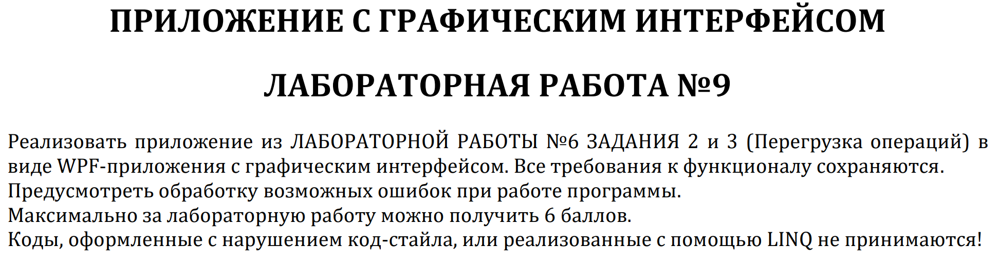
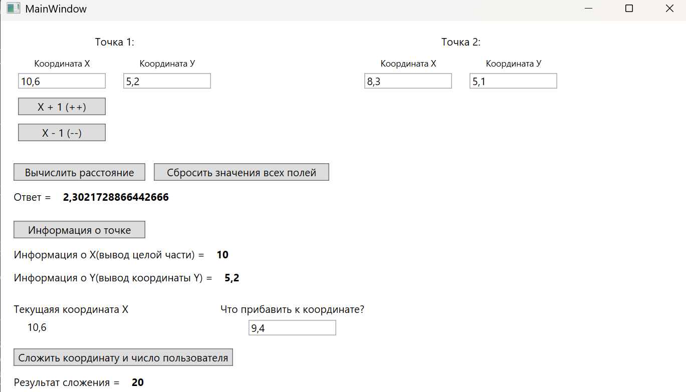
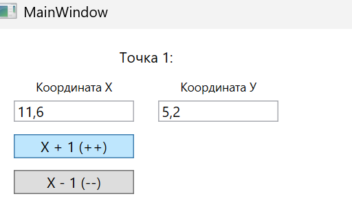
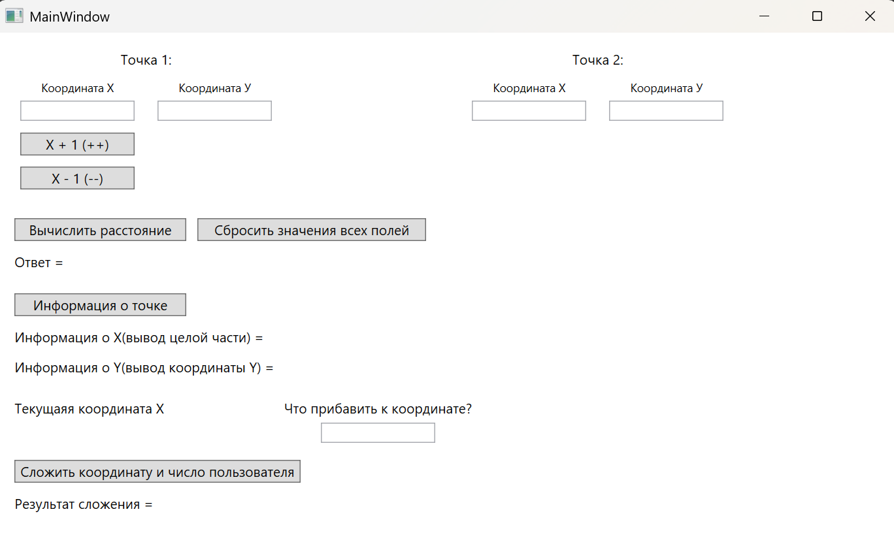

# Мартелов Елисей Группа ИТС1 Лабораторная №9

## Задание 1

### Задача 1

### Текст задачи

 

### Тестирование

#### При заполнении вех полей и нажатии всех кнопок

#### При нажатии кнопки "Х + 1", происходит увеличение X

#### При нажатии кнопки "Сбросить значения всех полей" - поля очищаются

